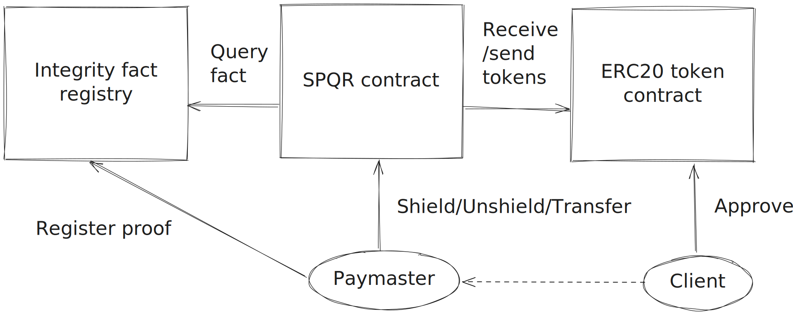
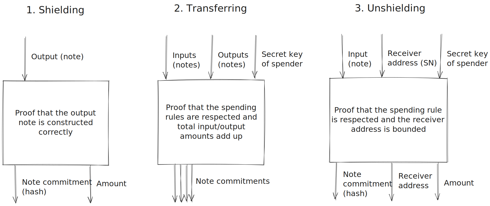

# Scalable Private Quantum Resistant Payments App

When was the last time you thought about the Roman Empire?

SPQR is a proof-of-concept of privacy payments on Starknet, utilizing STARKs and native account abstraction for integrity and confidentiality.

## Overview

SPQR is implemented as a single Starknet contract that interacts with the following contacts:
- ERC20 token (or multiple tokens) that is to be shielded (in this repo we use STRK)
- Integrity fact registry, for abstracting STARK proof verification

It is envisioned to use fee subsidization to break the link between Starknet accounts and crypto notes, however the current PoC does not implement this logic.

* Read more about [SPQR contract](./contracts/)
* Check Sepolia [deployment](https://sepolia.voyager.online/contract/0x05a10ca183a645a0edb7168d02f44ddfd7dfdb4ad84f2a5a7a9d36614e439ceb#accountCalls)

UTXO model is used for shielded accounts.
Shielded transactions are created and stored on the client and not broadcasted to keep the information about the sender, receiver, and amount private. A proof of validity is generated (also on the client) and submitted onchain to prevent double spending. The smart contract only stores the hashes of crypto notes (UTXOs) and relies on proofs to enforce integrity.

* Read more about [SPQR program](./program/)
* Check out registered [facts](https://sepolia.voyager.online/contract/0x16409cfef9b6c3e6002133b61c59d09484594b37b8e4daef7dcba5495a0ef1a#accountCalls)

## Notes on privacy

1. `cairo1-run` runner copies all inputs to the output segment which leads to the privacy leak. This is a known issue, which is resolved with the new version of `cairo-executor` that is able to produce execution trace (for proving).
2. Proofs that are generated with Stone leak some bits of the trace because polynomial randomization is not implemented. Read more in https://github.com/starkware-libs/stone-prover/issues/8#issuecomment-1766480334 also https://eprint.iacr.org/2024/1037
3. Nullifiers are not used (for simplicity) and hence some information about spent notes is leaked.
4. Transaction fees are not subsidized (but it is envisioned) so submitting a proof/private transfer might leak a connection between a Starknet account and a particular note.
5. Transactions are not encrypted (but they are note stored onchain either).